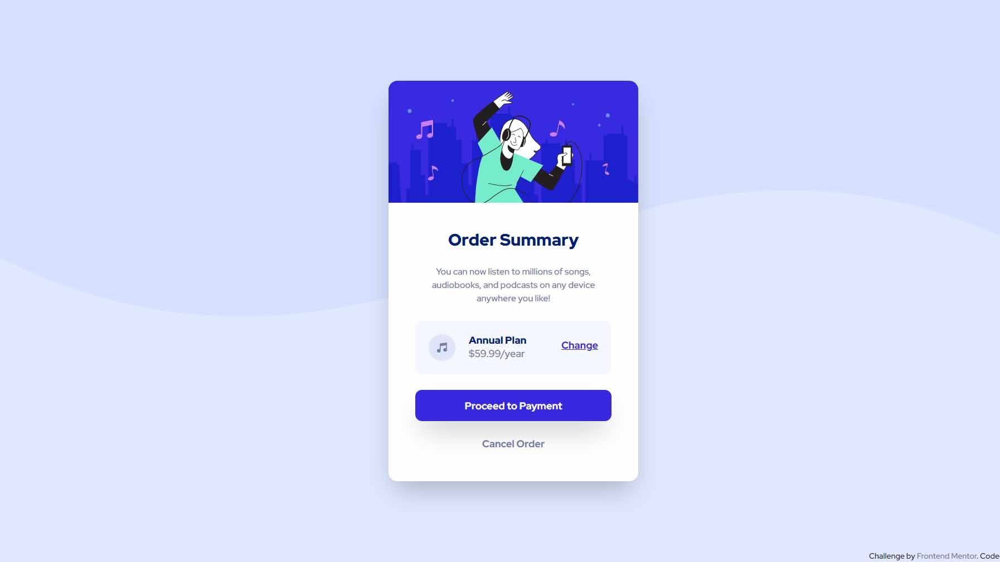

# Frontend Mentor - Order summary card solution

This is a solution to the [Order summary card challenge on Frontend Mentor](https://www.frontendmentor.io/challenges/order-summary-component-QlPmajDUj). Frontend Mentor challenges help you improve your coding skills by building realistic projects.

## Table of contents

- [Overview](#overview)
  - [The challenge](#the-challenge)
  - [Screenshot](#screenshot)
  - [Links](#links)
- [My process](#my-process)
  - [Built with](#built-with)
  - [What I learned](#what-i-learned)
  - [Continued development](#continued-development)
  - [Useful resources](#useful-resources)
- [Author](#author)
- [Acknowledgments](#acknowledgments)

## Overview

### The challenge

Users should be able to:

- See hover states for interactive elements

### Screenshot

### Links

- [Solution URL](https://your-solution-url.com)
- [Live Site URL](https://purrrplelipton.github.io/order-summary-component)

## My process

### Built with

- Semantic HTML5 markup
- CSS custom properties
- Flexbox
- CSS Grid
- Mobile-first workflow
- [React](https://reactjs.org/)
- [Vite](https://vitejs.dev/)
- [Chakra-UI](https://chakra-ui.com/)

### What I learned

Unnecessary nestings leave room for breakage and landmarks are important

### Continued development

I'm relatively still new to the whole responsiveness thing and chakra is fun to use but is a bit bulky. I want to know more about it tho.

### Useful resources

- [Chakra-UI for Beginers](https://www.chakrauiforbeginners.com/) - This is an amazing tutorial which helped me finally understand chakra-ui. I'd recommend it to anyone new to this framework.

## Author

- Frontend Mentor - [@purrrplelipton](https://www.frontendmentor.io/profile/purrrplelipton)
- Twitter - [@purrrplelipton](https://www.twitter.com/purrrplelipton)

## Acknowledgments

- [Esther Agbaje](https://estheragbaje.dev/)
